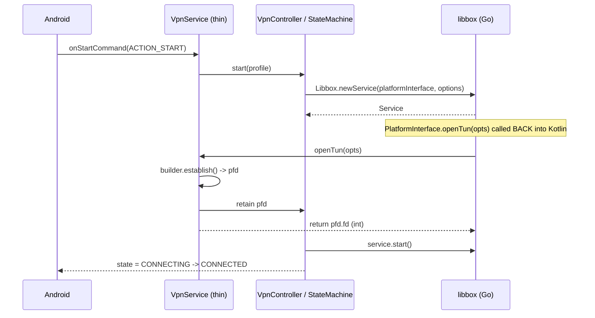

# Reference Architecture Study — Android `VpnService` / libbox integration

**Status:** Ready for Human Review · **Task:** P3-T4 · **Date:** 2026-09-27
**Applies to:** Brick VPN, pinned `sing-box v1.10.7` (commit `253b41936ecd6ae17948d49d9c510d7100830927`)

---

## 0. Executive summary and license compliance

### What this document is

An **architectural** study of two mature Android VPN clients, written to inform
P3-T5 (`VpnStateMachine`) and P3-T6 (`VpnService` skeleton). It is scoped to
**patterns that exist in our pinned sing-box v1.10.7 API**.

### Sources studied

| Source | Commit | License | Role |
|---|---|---|---|
| `SagerNet/sing-box-for-android` | `8e42c63` (2026-09-27) | GPL-3.0 | Primary pattern source |
| `hiddify/hiddify-app` | `276a7ef` (2026-06-17) | **Hiddify Extended GPL v3** | Corroboration |

### License compliance statement

**Zero lines of GPL source code were copied into this repository.** Both sources
were read to understand *architecture* — control flow, ownership rules, ordering
constraints. Nothing here is a transcription, translation, or derivative
rendering of their code. All file references below are `path:line` **pointers**
so a reviewer can verify a claim independently.

`hiddify-app` is **not** plain GPLv3: it carries GPLv3 §7 additional conditions
(NonCommercial Use Only; Naming/Interface Restrictions; mandatory GitHub-fork
source availability). These are recorded in `AI_ROLES/TOOLCHAIN_VERSIONS.md`.
**Recommendation stands: architectural study only, no code reuse, no
attribution-triggered fork.** This has not been reviewed by a lawyer.

### Why the study is version-scoped

Both references target a **newer sing-box** than ours. Their APIs do not match
our AAR, so their API surface is *not* usable as-is:

| | References | Our pinned v1.10.7 AAR |
|---|---|---|
| Java package | `io.nekohasekai.libbox.*` (sfa) · `com.hiddify.core.libbox.*` (hiddify) | **`io.nekohasekai.libbox.libbox.*`** (doubled) |
| `PlatformInterface` | ~38 methods | **18** |
| `InterfaceUpdateListener.updateDefaultInterface` | 4 args `(String, int, boolean, boolean)` | **2 args** `(String, int)` |

This document therefore teaches **patterns**, and pins every API detail to the
18-method interface extracted from our own artifact.

---

## Domain 1 — `VpnService` lifecycle & thin-service delegation

### The pattern

Both references make the Android `VpnService` a **shell** with no logic, delegating
every callback to a separate controller object. This is the single most
transferable structural decision in the whole study.

`sing-box-for-android/app/src/main/java/io/nekohasekai/sfa/bg/VPNService.kt`:
```kotlin
:29   override fun onStartCommand(intent, flags, startId) = service.onStartCommand()
:39   override fun onDestroy()        { service.onDestroy() }
:43   override fun onRevoke()         { runBlocking { withContext(Dispatchers.Main)
:46                                          { service.onRevoke() } } }
```

`hiddify-app/android/app/src/main/kotlin/com/hiddify/hiddify/bg/VPNService.kt`:
```kotlin
:28   override fun onStartCommand(intent, flags, startId) =
:29       service.onStartCommand()
:39   override fun onDestroy()  { service.onDestroy() }
:43   override fun onRevoke()   { service.onRevoke() }
```

### Why it matters here

`ARCHITECTURE.md` §3.5 requires an explicit state machine and forbids silent
coercion of impossible transitions. A state machine cannot live inside a
`VpnService` subclass cleanly: Android may recreate the service, the OS calls
`onRevoke` on the main thread, and `onDestroy` during teardown. Keeping the
Android component trivial means:

- the state machine is a **plain class**, unit-testable on the JVM with no
  Android framework, no Robolectric, no device;
- `VpnService` becomes a ~40-line adapter that the harness in P3-T2 can host;
- `MockVpnEngine` (P1-T5) already models this seam, so P3-T5 can be tested
  against a fake before any `VpnService` exists.

### Startup / shutdown sequences



Shutdown is the mirror image: `S->>V: onStopCommand(ACTION_STOP)` → `V->>C:
stop()` → `C->>L: service.stop()` → `C` closes the retained `pfd` → state
`DISCONNECTING -> DISCONNECTED`.

**Gate A note:** the current harness has no `VpnService` at all
(`BIND_VPN_SERVICE` is deliberately absent). This domain is design guidance for
P3-T6, not something to build now.

---

## Domain 2 — TUN file descriptor acquisition & non-detaching ownership

This is the **highest-value, most safety-critical** finding in the study, and it
is the direct remedy for the legacy project's TUN leak.

### The pattern

Both references acquire the `ParcelFileDescriptor`, **retain it in Kotlin**, and
pass only the raw integer FD to Go. **Neither ever calls `detachFd()`.**

`sing-box-for-android/…/bg/VPNService.kt`:
```kotlin
:184  val pfd = builder.establish()
          ?: error("android: the application is not prepared or is revoked")
:186  service.fileDescriptor = pfd     // Kotlin retains ownership
:187  return pfd.fd                     // Go receives a borrowed int
```

`hiddify-app/…/bg/VPNService.kt`:
```kotlin
:210  val pfd = builder.establish()
          ?: error("android: the application is not prepared or is revoked")
:211  service.fileDescriptor = pfd
:212  return pfd.fd
```

Verified: `grep -rn 'detachFd' android/app/src/main --include=*.kt` → **0 hits**
in hiddify. In sfa, `detachFd` appears only in `bg/RootServer.kt:267,275` for a
different purpose (root-shell FDs, not TUN).

### Why `detachFd()` must not be called

| | Keep PFD in Kotlin (chosen) | `detachFd()` |
|---|---|---|
| Ownership | Kotlin owns; Go borrows | Ownership transfers; nobody can close |
| GC safety | Field reference pins it | Detached PFD is unsafe to close |
| Leak risk | Low — one explicit close site | **High** — unrecoverable if Go exits |
| Legacy bug | Prevented | Reintroduces it |

`ARCHITECTURE.md` §3.5 requires "Every code path that opens a TUN file descriptor
must have a corresponding guaranteed cleanup path" and specifically calls out
the legacy failure: `startOrReloadService` failing *after* `openTun` succeeded.
Retaining the PFD in Kotlin makes the cleanup path a single, auditable statement.

### FD lifecycle for Brick VPN

```mermaid
stateDiagram-v2
    [*] --> NotEstablished
    NotEstablished --> Established: establish() returns pfd\nfield = pfd\nfd passed to Go
    Established --> Established: engine restart (reuses SAME pfd; no new establish)
    Established --> Closed: stop() / onRevoke() / onDestroy()\npfd.close()
    Closed --> [*]
```



Three rules for P3-T6:

1. `establish()` returning `null` is a **permission/revocation** signal, not a
   bug — both references treat it as a hard error with a specific message.
2. The PFD is stored **once**, in the controller, not in the `VpnService`.
3. Exactly one `close()` site, reached from `stop()`, `onRevoke()` **and**
   `onDestroy()`, and made idempotent.

---

## Domain 3 — Process model & crash isolation

### Finding: neither reference uses a separate VPN process

```bash
grep -rn 'android:process' /tmp/sing-box-for-android/app/src/main/AndroidManifest.xml   # no hits
grep -rn 'android:process' /tmp/hiddify-app/android/app/src/main/AndroidManifest.xml    # no hits
```

The `.bg.VPNService` name in sfa is a **package** segment, not a process
attribute. The task brief's premise of a `:bg` / `:vpn` process is **not** what
these projects do. This is a correction to the original P3-T4 framing, recorded
here rather than silently dropped.

What sfa *does* declare (`app/src/main/AndroidManifest.xml`):
```xml
:151  android:name=".bg.VPNService"
:153  android:foregroundServiceType="systemExempted"
:154  android:permission="android.permission.BIND_VPN_SERVICE"
```

### Recommendation: single process for Gate A

Matches both references, avoids an IPC boundary the mock cannot model, and keeps
P3-T5 testable. The real crash-isolation problem is not process separation — it is
that **a Go panic cannot be caught in Kotlin**. Neither reference solves that at
the JNI boundary (see Domain 4). The mitigation available to us is the
`MockVpnEngine` contract plus watchdog, not a second process.

---

## Domain 4 — JNI boundary & the exact 18-method interface

### The interface Brick VPN must implement

Extracted from our own artifact — **not** from the references:

```bash
javap -classpath . io.nekohasekai.libbox.libbox.PlatformInterface
```

`io.nekohasekai.libbox.libbox.PlatformInterface` — 18 methods:

| # | Signature (javap) | Group |
|---|---|---|
| 1 | `boolean usePlatformAutoDetectInterfaceControl()` | routing |
| 2 | `void autoDetectInterfaceControl(int) throws Exception` | routing |
| 3 | `int openTun(TunOptions) throws Exception` | **TUN** |
| 4 | `void writeLog(String)` | diagnostics |
| 5 | `boolean useProcFS()` | routing |
| 6 | `int findConnectionOwner(int, String, int, String, int) throws Exception` | per-app routing |
| 7 | `String packageNameByUid(int) throws Exception` | per-app routing |
| 8 | `int uidByPackageName(String) throws Exception` | per-app routing |
| 9 | `boolean usePlatformDefaultInterfaceMonitor()` | handover |
| 10 | `void startDefaultInterfaceMonitor(InterfaceUpdateListener) throws Exception` | handover |
| 11 | `void closeDefaultInterfaceMonitor(InterfaceUpdateListener) throws Exception` | handover |
| 12 | `boolean usePlatformInterfaceGetter()` | handover |
| 13 | `NetworkInterfaceIterator getInterfaces() throws Exception` | handover |
| 14 | `boolean underNetworkExtension()` | platform |
| 15 | `boolean includeAllNetworks()` | platform |
| 16 | `WIFIState readWIFIState()` | platform |
| 17 | `void clearDNSCache()` | platform |
| 18 | `void sendNotification(Notification) throws Exception` | UI |

Supporting types, same package:
- `InterfaceUpdateListener` — **one** method: `void updateDefaultInterface(String, int)`
- `TunOptions`, `NetworkInterfaceIterator`, `WIFIState`, `Notification`, `StringBox`, `ErrorMessage`

### Deliberately unavailable on v1.10.7

These exist in the references and are **not** part of our contract. P3-T5/P3-T6
must not reference them:

`checkPlatformShell` · `usePlatformShell` · `openShellSession` ·
`usePlatformAutoRedirect` · `createAutoRedirect` · `getRedirectListener` ·
`usePlatformBridge` · `createBridge` · `registerMyInterface` ·
`getRouteAddressSet` · `updateRouteAddressSet` · `startNeighborMonitor` ·
`closeNeighborMonitor` · `onNeighborTableUpdated` · `localDNSTransport` ·
`setEgress` · `readSystemSSHHostKey` · `tailscaleHostname`

### Panic safety — an honest gap

Neither reference traps Go panics at the JNI boundary. What sfa has is
`bg/CrashReportManager.kt` (JVM crash logs) and `BoxService.kt:448
triggerNativeCrash()` — a **debug-only** hook:

```kotlin
:448  override fun triggerNativeCrash() {
:451      throw RuntimeException("debug native crash")
```

**Implication for Brick VPN:** a Go panic terminates the process; it cannot be
recovered into a Kotlin `Err`. Our mitigations are architectural, not
exception-based: the session-token pattern and the hard-timeout stop watchdog
already built into `MockVpnEngine` (P1-T5). P3-T6 must ensure the watchdog can
force state to `DISCONNECTED` even if the Go side is wedged. This is an explicit
residual risk, not a solved problem.

### Threading

`onRevoke` arrives on the main thread. sfa marshals it explicitly
(`VPNService.kt:43-47`, `runBlocking { withContext(Dispatchers.Main) { … } }`).
P3-T6 must never block the main thread — `ARCHITECTURE.md` §3.5 N2.

---

## Domain 5 — State synchronization & event callbacks

### The libbox surface we have

`io.nekohasekai.libbox.libbox.CommandClient` (from our AAR) is the control
channel. Relevant native methods: `connect()`, `disconnect()`, `serviceReload()`,
`serviceClose()`, `closeConnection(String)`, `closeConnections()`,
`selectOutbound(String, String)`, `urlTest(String)`, `setClashMode(String)`,
`setGroupExpand(String, boolean)`, `getSystemProxyStatus()`, `getDeprecatedNotes()`.

sfa wires it as `io.nekohasekai.sfa.utils.CommandClient`, constructed in
`bg/ServiceNotification.kt:49` with a `CommandClient.Handler` (`:32`) and
`ConnectionType.Status` (`:49`); `bg/UpdateProfileWork.kt:96` uses
`Libbox.newStandaloneCommandClient().serviceReload()` for out-of-band reloads.

### Recommendation

- **Commands in:** one `CommandClient` owned by the controller, opened on
  connect, closed on stop. Never per-UI-call.
- **State out:** a Kotlin-side `StateFlow<ConnectionState>` fed by the state
  machine, **not** by polling libbox. This keeps `MockVpnEngine` substitutable.
- **Stats out:** a periodic sampler reading counters, throttled to avoid waking
  the UI thread at libbox's rate.
- **Bridge to Flutter is Gate B** (Pigeon/EventChannel), deliberately out of
  scope here.

---

## Domain 6 — Network handover & reconfiguration

### The reference mechanism

sfa's `bg/DefaultNetworkMonitor.kt` is the handover engine:

```kotlin
:16  fun start()                        // DefaultNetworkListener.start + activeNetwork
:28  fun stop()
:30  fun require(): Network
:38  fun setListener(listener)          // then immediately re-checks
:43  private fun checkDefaultInterfaceUpdate(newNetwork) {
:45      for (times in 0 until 10) {
:46          val linkProperties = connectivity.getLinkProperties(newNetwork)
:47          if (linkProperties == null) { Thread.sleep(100); continue }
              …
              listener.updateDefaultInterface(name, index, false, false)
```

Supporting: `bg/DefaultNetworkListener.kt:140,192,208` register best-matching
(default) network callbacks, with a comment at `:178` noting
`registerDefaultNetworkCallback` returns the VPN interface itself on Android P
DP1 — a real self-feedback hazard.

### The version trap

The reference calls `updateDefaultInterface(name, index, false, false)` — four
arguments. **Ours takes two:** `void updateDefaultInterface(String, int)`.
Porting the call verbatim **will not compile**. This is the clearest single
example of why the study is version-scoped.

### Recommendation

- Implement `startDefaultInterfaceMonitor` with a `DefaultNetworkMonitor` analogue
  in Kotlin, using `ConnectivityManager.registerDefaultNetworkCallback`.
- **Apply the reference's 10×100 ms retry loop** — link properties are briefly
  null right after a handover. This is a pattern, not an API, and is directly
  portable.
- **Exclude the VPN interface from the callback** to avoid the self-feedback
  loop sfa documents at `DefaultNetworkListener.kt:178`.
- Prefer **interface update** (cheap) over **engine restart** (expensive). Only
  restart if v1.10.7 cannot recover; that is a P3-T6 empirical question.
- Gate A has no TUN at all, so this is deferred design guidance.

---

## Blueprint for P3-T5 and P3-T6

### P3-T5 — `VpnStateMachine`

A plain Kotlin class, no Android imports, mirroring the transitions already
enforced by `MockVpnEngine` (P1-T5):

```
DISCONNECTED → CONNECTING → CONNECTED → DISCONNECTING → DISCONNECTED
CONNECTING → ERROR ; CONNECTED → ERROR ; ERROR → CONNECTING / DISCONNECTING
```

- `Connected → Error` **must** be legal (unexpected drop), matching
  `ARCHITECTURE.md` §3.2 and the P1-T5 hardening.
- `Disconnecting → Error` and `Disconnecting → Connecting` are **forbidden** —
  teardown must converge.
- Session token per start attempt; stale callbacks discarded at receipt.
- Hard stop watchdog: a stuck `DISCONNECTING` is a P0 bug (P1-T5 already
  implements this).

### P3-T6 — `VpnService` skeleton

| Concern | Recommendation |
|---|---|
| Class shape | Thin `VpnService` delegating to a controller, per Domain 1 |
| Logic home | Controller class; testable without Android |
| TUN | `establish()` → retain PFD → return `pfd.fd`; **never** `detachFd()` |
| PFD close | One idempotent close site, reached from `stop`/`onRevoke`/`onDestroy` |
| Handover | `DefaultNetworkMonitor` analogue with the retry loop |
| Threading | Never block main; `onRevoke` marshalled |
| Panic | Unrecoverable; rely on watchdog + session token, document the gap |
| Interfaces | Exactly the 18 methods in Domain 4, nothing newer |

### Pre-flight checklist for P3-T6

1. `javap` the AAR before writing the `PlatformInterface` implementation and
   treat its output as the contract.
2. Confirm the package is `io.nekohasekai.libbox.libbox` (doubled) in generated
   code and imports.
3. Write the `PlatformInterface` implementation first and compile it alone.
4. Add a test asserting exactly one `establish()` per service generation.

---

## Residual risks

| Risk | Severity | Mitigation |
|---|---|---|
| Go panic kills the process | High | Watchdog + session token; **unrecoverable** |
| TUN FD leak on early failure | High (legacy) | Non-detaching PFD ownership, one close site |
| Handover self-feedback via VPN interface | Medium | Exclude VPN iface from default-network callback |
| Reference API drift on future bump | Medium | `javap` before each bump; the 18-method table must be regenerated |
| No device available to verify | High for P3-T6 | Blocks runtime validation of everything above |

## Related documents

- `AI_ROLES/ARCHITECTURE.md` §3.2 (state graph), §3.5 (N1–N10 native standards)
- `AI_ROLES/TOOLCHAIN_VERSIONS.md` (pinned versions, `slices`/Go correction)
- `native/android/README.md` (harness build/run)
- `AI_ROLES/PROJECT_STATE.md` §6 (open items)
